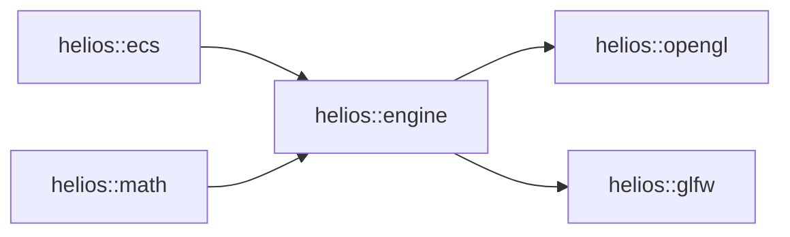

# Module Overview

helios is now organized into dedicated repositories/modules with clear responsibilities.
This section links to documentation synchronized from each module's root `README.md`.

## Available Modules

- [helios::ecs](/docs/modules/helios-ecs): Generic ECS primitives and storage/query infrastructure
- [helios::engine](/docs/modules/helios-engine): Core runtime and engine-level systems
- [helios::math](/docs/modules/helios-math): Math types and operations for graphics/gameplay
- [helios::opengl](/docs/modules/helios-opengl): OpenGL backend integration
- [helios::glfw](/docs/modules/helios-glfw): GLFW-based platform integration

## Module Dependency Graph

- An edge `A -> B` means: **B directly depends on A**.
- This graph shows only **internal helios module dependencies** (no third-party libraries such as GLFW/GLAD/ImGui).

## Notes

- The synchronized pages are generated automatically by `scripts/sync-changelog.mjs`.
- Edit source content in the module `README.md` files, not in generated docs.
